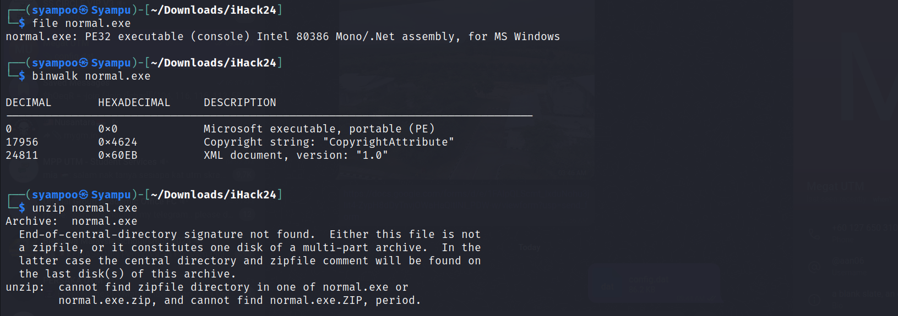
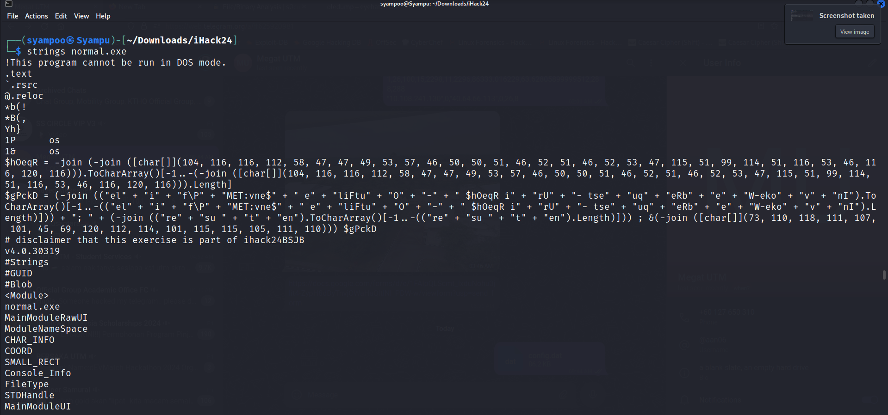
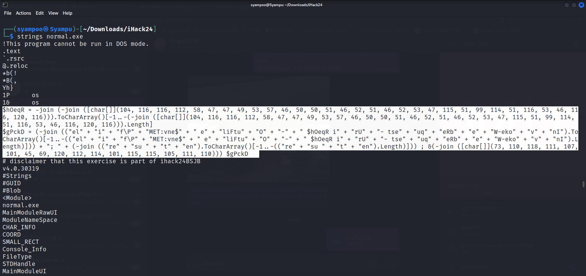
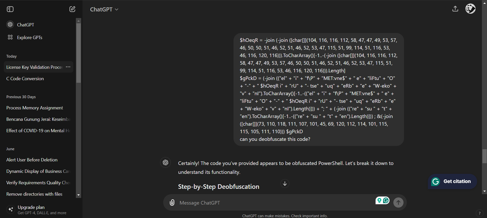
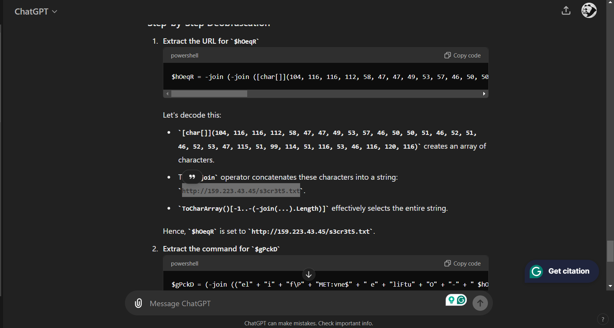
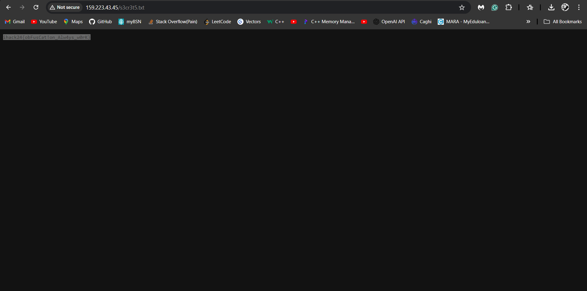

First, we download the file and move it to a working directory. After that, we have to check the files first.
By using file cmd in Linux, we can see that it is an MS executable file plus, it also contains an XML document within the executable file which prompts me to unzip the .exe file to get to the XML document.

After trying to unzip the .exe, I decided that the file could not be unzipped further and moved on to the next logical step, finding any strings within the .exe file.
To find strings, I use strings cmd in Linux to find any relevant strings in the .exe file.

After going through the strings in the file, I found something interesting within the strings. A piece of string that resembles a PowerShell code.

After examining the string resembling a PowerShell code, I can conclude that it is indeed a PowerShell code but is obfuscated. Therefore, I use ChatGPT to deobfuscate the code for me.

After examining the deobfuscated code, I found another clue: a long array of numbers inside a char[] variable, which I think could be converted into strings.

After asking the ChatGPT to decode the array of numbers, we got a link that led us directly to the flag.
Link to the flag: http://159.223.43.45/s3cr3t5.txt

